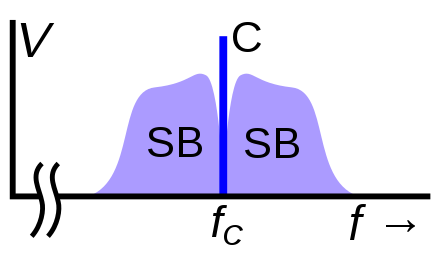
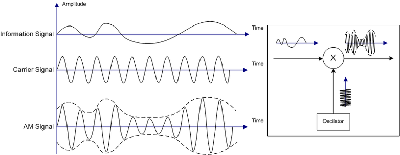
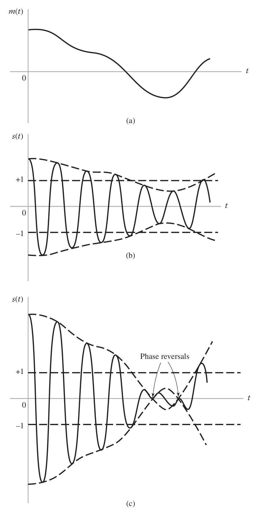
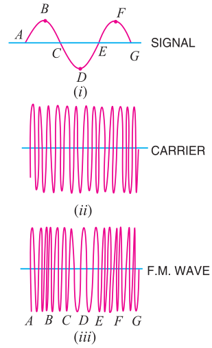

<!-- markdown-toc start - Don't edit this section. Run M-x markdown-toc-refresh-toc -->
**Conteúdos :**

- [Compartilhamento dos meios](#compartilhamento-dos-meios)
    - [Multiplexação no tempo](#multiplexação-no-tempo)
    - [Multiplexação em frequência](#multiplexação-em-frequência)
- [Modulação em frequência](#modulação-em-frequência)
    - [Limite de banda da mensagem](#limite-de-banda-da-mensagem)
    - [Portadora](#portadora)
    - [Modulação AM](#modulação-am)
        - [Teoria (via exemplo)](#teoria-via-exemplo)
        - [Super modulacao (overmodulation)](#super-modulacao-overmodulation)
    - [Demodulação AM](#demodulação-am)
        - [Teoria (via exemplo)](#teoria-via-exemplo-1)
- [Modulação em frequência](#modulação-em-frequência-1)
    - [Referências](#referências)

<!-- markdown-toc end -->

# Compartilhamento dos meios

Diversos canais de comunicação podem compartilhar o mesmo meio de transmissão/recepção de dados. Uma fibra ótica que conecta o Brasil nos Estados Unidos conecta milhões de dispositivos por meio de um único meio (a fibra). Já o ar é utilizado por diversas emissoras de televisão e rádio para propagação dos seus programas.

Existem duas formas básicas de compartilhamento dos meios de comunicação : multiplicação no tempo e multiplexação na frequência.

## Multiplexação no tempo

Na multiplexação no tempo apenas um canal de comunicação utiliza o meio por vez. Os canais alternam a utilização baseado em um tempo pré definido de uso.

[Multiplexação no tempo. REF 1](./figs/timeMultiplexing.png)

## Multiplexação em frequência 

Na multiplexação em frequência todos os nós utilizam o canal de forma simultânea porém em frequências bem limitadas. Para isso utiliza-se alguma das técnicas de deslocamento em frequência para mover a mensagem da frequência original (centrada no 0 Hz) para uma frequência de transmissão. 
Um exemplo da multiplexação no tempo em um meio bem definido é o da fibra ótica onde podemos ter vários links de comunicação ocorrendo de forma simultânea, cada um utilizando um espectro de sinal diferente (cores diferentes para cada canal). 

Essa técnica de multiplexação é amplamente utilizada nos sistemas de comunicação moderno e é a base da televisão do rádio do wifi da comunicação com satélites. A multiplexação em frequência é realizada em duas etapas: Limite da banda original da mensagem e modulação.

# Modulação em frequência

A modulação em frequência é o método de compartilhar um meio de comunicação entre diversas mensagem por meio do limite em frequência que cada mensagem pode ocupar. A figura a seguir ilustra um espectro na qual diversas mensagens ocupam regiões diferentes do espectro:

Na figura, a mensagem m1(t) está centrada na frequência F1, a mensagem m2(t) está centrada na frequência F2 e assim por diante.

O desafio está em como deslocar a mensagem que é centrada em 0Hz para uma frequência, para isso existem duas técnicas amplamente utilizadas: modulação em amplitude (AM) e modulação em frequência (FM).

## Limite de banda da mensagem

Uma mensagem ocupa geralmente um amplo espectro de frequência, uma das etapas da modulação em frequência é o de limitar esse espectro para que a banda da mensagem caiba na banda disponível para transmissão. Com isso temos a penalidade de perda de parte da informação original da mensagem.

O limite da banda acontece normalmente através de um [filtro](https://en.wikipedia.org/wiki/Low-pass_filter) passa baixas aplicado na mensagem original antes da modulação. Filtros atuam na mensagem "limitando" algumas frequências do sinal.

O projeto do filtro é realizado normalmente em frequência, defini-se o tipo do filtro (passa baixas, passa altas, passa faixa) suas características construtivas (FIR, IR, janela) e de projeto (banda e frequência de corte). Com o filtro definido deve-se agora "realizar" o filtro, esse é o processo na qual encontra-se o filtro que satisfaz os requisitos anteriores.

## Portadora

A [portadora](https://en.wikipedia.org/wiki/Carrier_wave) de uma modulação é o sinal que irá "carregar" a mensagem, a combinação da portadora mais a mensagem gera o sinal modulado. A frequência da portadora é geralmente definida por : $f_c$ (carry frequency) e um amplitude $A_c$, defina por:

$$c(t) = A_c cos(2 \pi f_c t)$$

A mensagem modulada estará centrada na frequência da portadora, como na imagem a baixo :

{width=45%}

## Modulação AM

A primeira técnica de modulação que surgiu foi a da modulação em amplitude que se popularizou na transmissão de sinais de rádio. Essa técnica modula a amplitude de uma portadora a partir da mensagem que deseja ser transmitida :

$$am(t) = M(t)*A_c sin(2 \pi f_c t)$$

onde: am(t) é a mensagem modulada, M(t) é a mensagem que deseja-se modular e $A_c sin(2 \pi f_c t)$ a portadora centrada na frequência $f_c$. A figura a seguir ilustra uma mensagem sendo modulada em amplitude :

{width=80%}

Note que a amplitude da senoide de alta frequência (portadora) assume o formato do sinal de baixa frequência (mensagem), formando o que se chama de **envelope de modulação**. Para a modulação AM basta-se gerar uma senoide (pode-se utilizar por exemplo o CI 555) e multiplicar essa senoide pela mensagem (para isso utiliza-se transistores). 

> Quais são os tipos de modulação AM e quais as principais diferenças (Double Side Band, Single Side Band, ....).

> Reproduza o espectro das diferentes técnicas de modulação pesquisadas anteriormente.

> Quem foi a primeira pessoa a propor a utilização da modulação AM

> Escolha um circuito analógico que faz a modulação AM e explique o seu funcionamento.

### Teoria (via exemplo)

Uma portadora qualquer é dado por :

$$c(t) = A sin(2 \pi f_c t)$$

Uma mensagem m(t) representada por um cosseno é dado por :

$$m(t) = M.cos(2 \pi f_m t + \phi)$$

Obtemos a mensagem modulada em AM :

$$am(t) = M.cos(2 \pi f_m t + \phi).A sin(2 \pi f_c t)$$
$$am(t) = A.M(cos(2 \pi f_m t + \phi).sin(2 \pi f_c t))$$

Podemos usar a propriedade trignométrica :

$$\sin a \cos b = \frac{\sin(a + b) + \sin(a - b)}{2}$$

E obtemos :

$$am(t) = \frac{AM}{2} \sin(2 \pi (f_c + f_m) t + \phi) + \frac{AM}{2}\sin(2 \pi (f_c - f_m) t - \phi)$$

O que obtivemos foi a mensagem original m(t) duplicada nas frequências $+f_c$ e $-f_c$ com ganho alterado de : $AM/2$ e fase alterada em $\pi/2$.

> Realize as mesmas etapas porém exibindo o resultado obtido no espectro.

### Super modulacao (overmodulation)

Devemos garantir que M(t) seja sempre inferior 1 : M(t) < 1, caso isso não aconteça um fenômenos de super modulação acontece e a reconstrução da mensagem via demodulação acarretará em perda de informação.

{width=60%}

> Faça um programa em python que simule a super modulação, nesse programa utilize uma mensagem formada por uma senoide de baixa frequência modulada em AM. Exiba e analise os gráficos da mensagem no tempo para : M = 0; M = 0.5; M = 0.7; M = 1; M=1.25; M=1.5.

> Uma portadora de frequência 10Mhz com valor de pico de 10V é modulada em amplitude por um seno de 5Khz e amplitude de 6V. Determine o fator de modulação e a banda ocupada pelo sinal.

## Demodulação AM

A demodulação AM pode ser realizada simplesmente pela multiplicação da mensagem modulada am(t) novamente pela portadora. Após realizado essa etapa, aplica-se novamente o filtro passa baixa na mensagem e a mensagem m(t) transmitida originalmente é recuperada (a menos da diferença do ganho).

$m(t) = am(t).sin(2 \pi f_c t)$ ; aplicado a um filtro passa baixas.

### Teoria (via exemplo)

Para demodularmos o sinal am(t) criado no exemplo anterior (para A = 1 e M =1):

$$am(t) = \frac{1}{2} \sin(2 \pi (f_c + f_m) t) + \frac{1}{2}\sin(2 \pi (f_c - f_m) t)$$

Basta multiplicarmos o sinal am(t) pela portadora c(t) :

$$m'(t) = [\frac{1}{2} \sin(2 \pi (f_c + f_m) t) + \frac{1}{2}\sin(2 \pi (f_c - f_m) t)] . A \, sin(2 \pi f_c t)$$

Via distribuição, obtemos :

$$m'(t) = \frac{1}{2} \sin(2 \pi (f_c + f_m) t) . A \, sin(2 \pi f_c t) + \frac{1}{2}\sin(2 \pi (f_c - f_m) t ) . A \, sin(2 \pi f_c t)$$

Aplicando a identidade trigonométrica :

$$\sin a \sin b = \frac{\cos(a - b) - \cos(a + b)}{2}$$

Obtemos :

$$m'(t) = \frac{1}{4}[\cos(2 \pi f_m t) - cos(2 \pi (2 f_c + f_m) t)] + \frac{1}{4}[ \cos(- 2 \pi f_m t) - \cos(2 \pi (-2 f_c + f_m) t)]$$

> Realize as mesmas etapas porém exibindo o resultado obtido no espectro.

# Modulação em frequência

A modulação em frequência (FM) é uma outra técnica de modulação de sinal que faz uso de uma portadora porém agora a portadora não possui a amplitude modulada pela mensagem mas sim sua frequência :

$$fm(t) = A_c cos(2 \pi f_c \mathbf{m(t)})$$

Onde m(t) é a mensagem a ser modulada, $A_c \, cos(2 \pi f_c)$ o sinal da portadora. O resultado é ilustrado na forma de onda a seguir :

{width=40%}

Algumas notas sobre a modulação FM :
 
- A frequência derivada da modulação depende da amplitude da mensagem.
- A frequência central da modulação FM é a resultante de quando a m(t) = 0

A modulação FM possui algumas vantagens sobre a AM, entre elas : 

- Potência constante :

A potência transmitida durante uma transmissão FM é constante :

$$P_{med}=\frac{1}{2}A_c^2$$

Isso já não é verdade na modulação AM.

- Dificuldade na visualização da mensagem

Na modulação AM é fácil visualizarmos a mensagem modulada na portadora simplesmente pela análise do envelope, isso já não é verdade na modulação FM, onde não existem um envelope.

- Melhor tolerância a ruído aditivo

A modulação FM possui maior tolerância a ruídos aditivos que a modulação AM, já que dificilmente um ruído irá influenciar na frequência do sinal, mas pode facilmente influenciar a amplitude da onda AM.

> Dado uma mensagem modulada em FM : $fm(t) 12 cos (6 × 10 t + 5 sin 1250 t)$, encontre : A frequência da portadora, a frequência do sinal, a banda ocupada para transmissão da mensagem.

> Liste aplicações comercias que utilizam modulação AM e FM.

> O que é index de modulação FM ? Como o mesmo é calculado ?

## Referências

- [1] : https://en.wikipedia.org/wiki/Time-division_multiplexing

- [2] : https://en.wikipedia.org/wiki/Filter_(signal_processing)

- [3] : https://en.wikipedia.org/wiki/Carrier_wave
