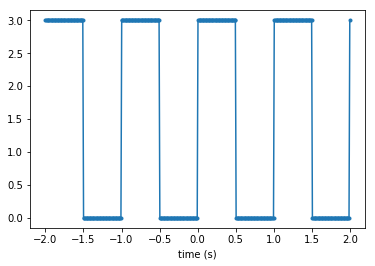
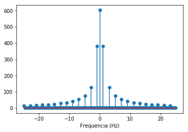
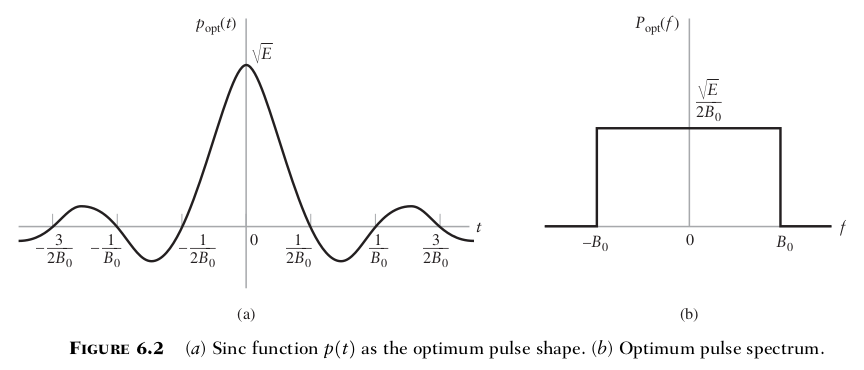
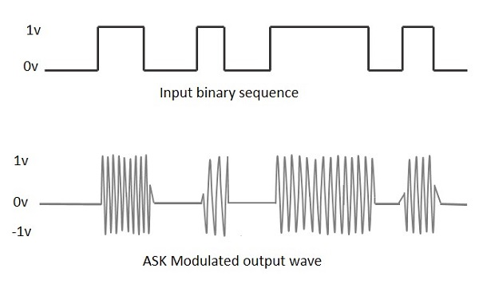
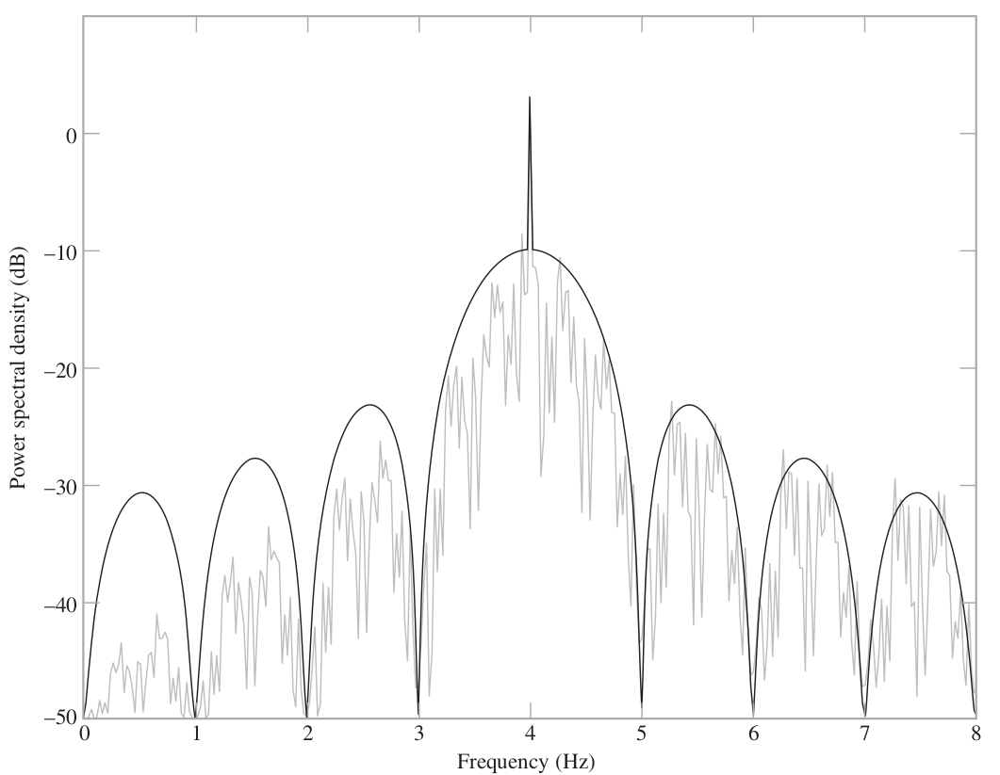

<!-- markdown-toc start - Don't edit this section. Run M-x markdown-toc-refresh-toc -->
**Table of Contents**

- [Transmissão digital](#transmissão-digital)
    - [Banda Base](#banda-base)
        - [Pulse shapping](#pulse-shapping)
- [Modulação](#modulação)
    - [Amplitude Shift Keying (ASK)](#amplitude-shift-keying-ask)
- [Phase-Shift Keying (PSK)](#phase-shift-keying-psk)
- [Referências](#referências)

<!-- markdown-toc end -->

# Transmissão digital 

A transmissão digital é uma das maneiras de transmitirmos um sinal digital (uns e zeros) via um meio de comunicação (compartilhado ou não). Um meio de comunicação possui necessariamente restrição de banda (o quanto a mensagem pode ocupar de frequência), essa restrição é causada por dois motivos : a. os meios de comunicação não possuem banda infinita; b. o meio de comunicação é compartilhado com outros canais.

## Banda Base

Se pegarmos por exemplo uma transmissão binária simulada por uma onda quadrada de  baudrate 2 bps (2 bits por segundo) a figura a seguir ilustra a transferência de 1 0 1 0 1 0 1 0 como sendo a mensagem :

{width=40%}

Obtemos a seguinte transformada de Fourier :

{width=40%}

Verifica-se que a banda ocupada por esse sinal é limitado em torno de 15Hz (maior parte da composição espectral), o que acontece se aumentarmos a frequência dessa onda quadrada para por exemplo 9600 bps ? A frequência ocupada pelo sinal irá aumentar para algo em torno de 13Khz. Essa proporção aumenta junto com o aumento do baudrate, ou seja, quanto maior for a taxa de transmissão maior é a banda ocupada pelo canal.

A banda do sinal não é um fator muito importante quando a transmissão é realizada por um canal dedicado (par trançado, fibra ótica, cabo coaxial, ....) já que o meio não é compartilhado entre nenhum outro canal, mas quando o meio é compartilhado com outros canais existe um limite na qual uma comunicação pode usar de banda em uma determinada frequência. A transmissão digital busca basicamente um grande objetivo : transmitir mais dados com menor banda e erro.

### Pulse shapping

[Pulse shapping](https://en.wikipedia.org/wiki/Pulse_shaping) é uma técnica de transmissão de bits na qual modifica-se o formato do bit para que o sinal transmitido ocupe menos banda. Para isso, utiliza-se a transmissão não mais de um pulso mas sim de dois tipos de sinais : Sync e Cosseno Levantado, a vantagem de fazermos isso é que agora ocupamos uma banda limitada para a transmissão de cada bit, como na figura a seguir :

{width=80%}

# Modulação 

Em meios compartilhados (como um link de radio frequência) a transmissão de um sinal digital deve ser deslocada para uma frequência específica (portadora), existem diversas técnicas que permitem isso, sendo alguma delas :

- Amplitude Shift Keying (ASK)
- [Frequency-shift keying (FSK)](https://en.wikipedia.org/wiki/Frequency-shift_keying)
- [Phase-shift keying (PSK)](https://en.wikipedia.org/wiki/Phase-shift_keying)
- [Quadrature amplitude modulation (QAM)](https://en.wikipedia.org/wiki/Quadrature_amplitude_modulation)

## Amplitude Shift Keying (ASK)

A transmissão via [ASK](https://en.wikipedia.org/wiki/Amplitude-shift_keying) é similar a transmissão AM, pega-se o sinal a ser transmitido e multiplica-se pela portadora como ilustrado a seguir :

{width=60%}

A transmissão via ASK permite o envio de apenas um símbolo por vez (0 ou 1), não sendo a forma de transmissão digital mais eficiente.

# Phase-Shift Keying (PSK)

A modulação PSK lida coma a variação da fase da portadora e não de sua amplitude, isso permite o envio de mais de um símbolo por vez. Pode-se definir por exemplo que os símbolo formado por 00 aplica uma variação de fase de 45 graus na portadora, o símbolo 01 uma variação de 135 graus, conforme tabela a seguir :

| Símbolo | Fase |
|---------|------|
|      00 |   45 |
|      01 |  135 |
|      11 |  245 |
|      10 |  315 |
   
Para visualizarmos a transmissão/recepção desses símbolos utilizamos uma forma gráfica chamada de diagrama de constelação. O mapa de constelação mostra o bit recebido e em qual quadrante tele se encontra.

> O que é samples per symbol (sps) ?

> Compare os tipos de modulação : ASK, PSQ, QAM, FSK. Explique o conceito de cada uma dessas técnicas.

> Pesquisa quais as técnicas utilizadas por: Wifi, Bluetooth. Quais a frequências utilizadas ?

> O que é Code Division Multiple Access (CDMA) ?

> Uma codificação 4-PSK define 9 símbolos para codificação dos dados, crie uma tabela que associa junção de bits, símbolo e fase da codificação.

> Deseja-se transmitir uma mensagem amostrada a 18Khz com uma resolução de 12 bits via o 4-PSK definido anteriormente, qual o tempo total de transmissão ? Dado que o Samples Per Symbol é 50.

# Referências

 - REF 1 : An Introduction to Analog and Digital Communications, 2nd Edition by Simon Haykin
 - REF 2 : https://www.tutorialspoint.com/digital_communication/digital_communication_amplitude_shift_keying.htm
