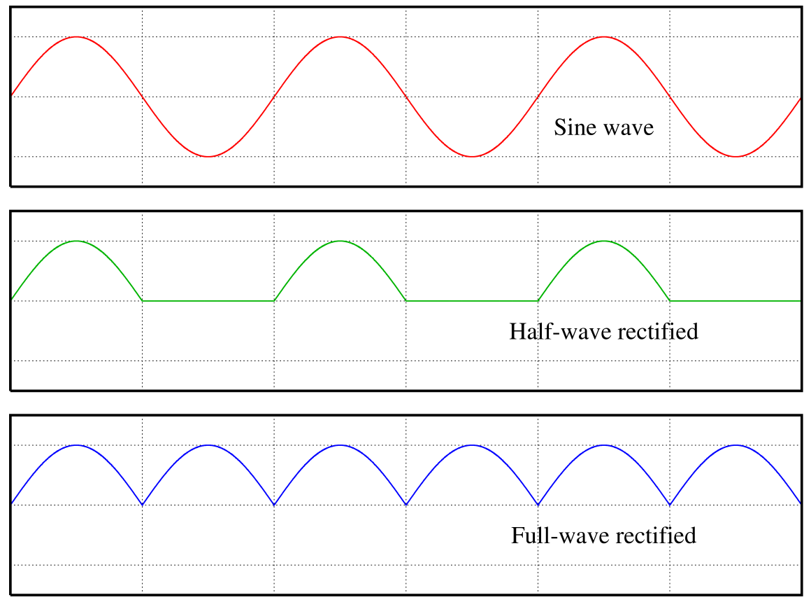
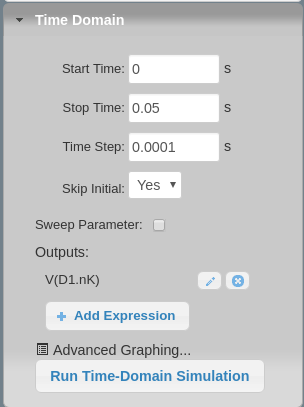

--
title: Camada Física - 18 - Diodos Retificador
author: Rafael Corsi
date: Novembro - 2017
---

<!-- markdown-toc start - Don't edit this section. Run M-x markdown-toc-refresh-toc -->
**Table of Contents**

- [Diodos](#diodos)
    - [Retificador de meia onda](#retificador-de-meia-onda)
        - [Simulação](#simulação)
        - [Gerando um sinal DC](#gerando-um-sinal-dc)
    - [Retificador de onda completa](#retificador-de-onda-completa)

<!-- markdown-toc end -->

# Diodos 

Diodos são componentes eletrônicos do tipo bipolo que limitam a passagem da corrente elétrica em dos sentidos.

## Retificador de meia onda

Retificadores são dispositivos eletrônicos que permitem transformar uma tensão alternada em algo contínuo/ limitado a um nível (positivo/negativo). Os retificadores são encontrados em praticamente toda fonte AC-DC (carregador de celular/ notebook ....) utilizado para gerar um corrente contínua (DC) a partir de uma corrente alternada (AC).

Utilizando o site : circuitlab.com projete um retificador de meia a partir do exemplo a seguir utilizando os seguintes componentes :

- Voltage Function Generator 
    - 110V 
    - 60Hz
- Transformador (trafo)
    - N = 12.2 (número de voltas da bobina)
- Diode 
    - 1N4148
- Resistor
    - 100 ohms

{width=60%}

### Simulação 

Execute a simulação temporal (*Time Domain*) do circuito recém projetado, para isso clique em :

Simulate -> Time Domain, e configure :

{width=50%}

e execute a simulação clicando em : *Run Time-Domain Simulation*

> Explique o que está acontecendo 

### Gerando um sinal DC

Adicione um capacitor de 100 uF em paralelo com o resistor (carga), execute a simulação e analise o resultado.

> Explique o papel do capacitor

> O que é ripple ? 

> Calcule o ripple do sinal DC gerado

## Retificador de onda completa

Retificadores de meia onda "descartam" a parte negativa da senoide gerando um ripple mais elevado na saída, uma alternativa para o retificador de meia onda é o retificador de onda completa que faz uso de todo o sinal de entrada, espelhando a parte negativa para a positiva.

Modifique o circuito adicionando mais três diodos para realizar uma retificação de onda completa.

- **Dica : https://www.allaboutcircuits.com/textbook/semiconductors/chpt-3/rectifier-circuits/**

> Calcule o ripple do sinal DC gerado

## Referências 

- [1] : https://pt.wikipedia.org/wiki/Ficheiro:Rectified_waves.png
