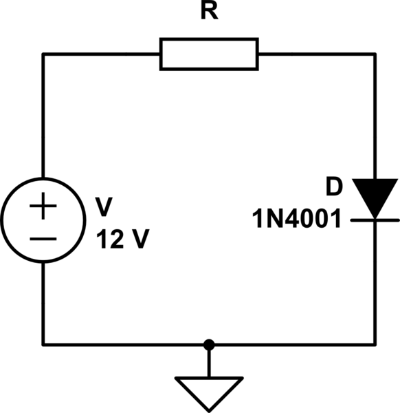
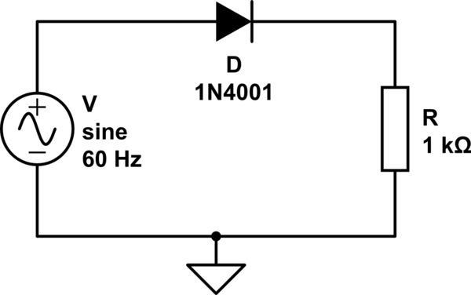
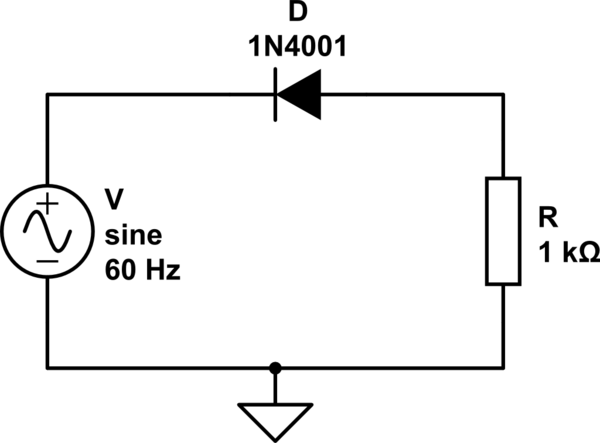
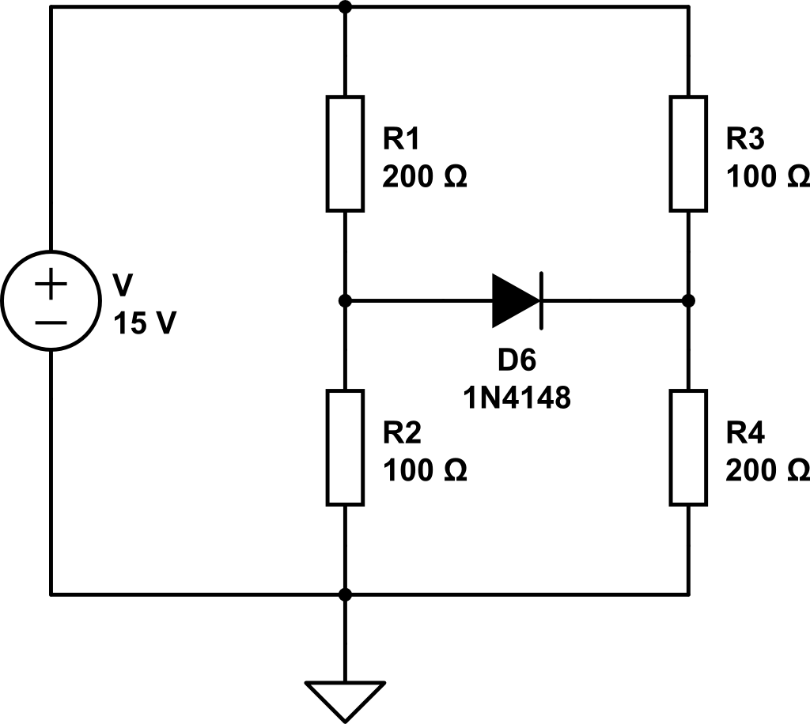
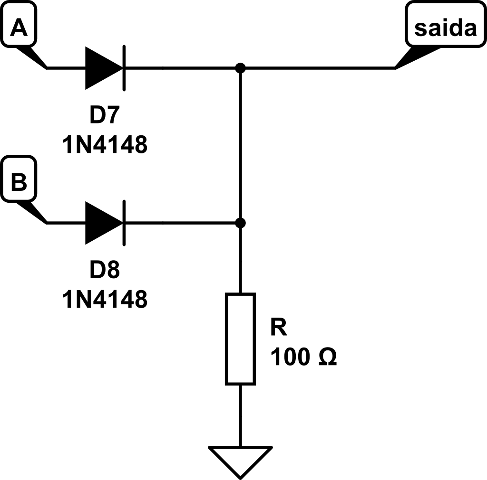

# Exercícios circuito diodos 

Resolva os seguintes circuitos com diodos de silício (Vs=0.7V).

### a
Qual o valor de resistência para que a corrente no diodo seja ao menos 20mA?

{width=30%}

### b

Esboce a forma de onda da tensão no resistor. A amplitude da tensão da fonte senoidal é 15V. Confirme no simulador.

{width=30%}

### c

Esboce a forma de onda da tensão no resistor. A amplitude da tensão da fonte senoidal é 15V.  Confirme no simulador.

{width=30%}

### d

Resolva o circuito e encontre o valor da corrente no diodo (I_D)

{width=30%}

### e

Este circuito se comporta como uma porta lógica! Qual? Determine a tensão de saída para as combinações lógicas de entrada. Considere VON = 5V e VOFF = 0V

{width=30%}

### f 

Projete um circuito que implemente uma porta E
