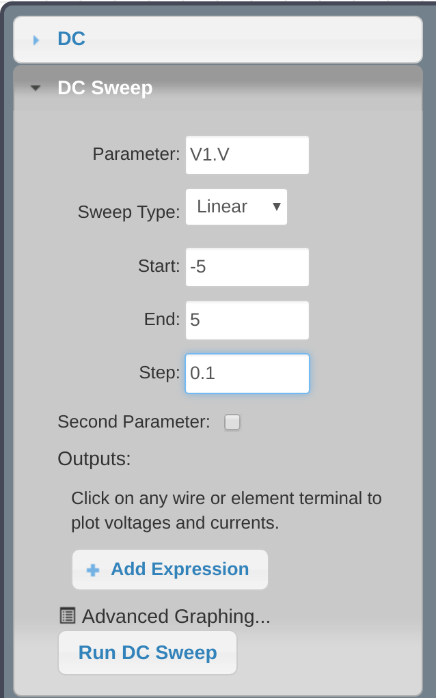

<!-- markdown-toc start - Don't edit this section. Run M-x markdown-toc-refresh-toc -->
**Table of Contents**

- [Diodo condução/corte](#diodo-conduçãocorte)
    - [Condução](#condução)
- [Curva do diodo](#curva-do-diodo)
    - [Simulação](#simulação)
        - [Curva](#curva)
- [Carva do diodo Zener](#carva-do-diodo-zener)
- [Pesquisas](#pesquisas)

<!-- markdown-toc end -->

# Diodo condução/corte

O diodo opera basicamente em duas regiões : Corte / condução, a região de corte é aquela que não existe corrente atravessando o diodo e a de condução é a situação na qual o diodo está conduzindo corrente.

## Condução

Descubra a corrente de início de condução do diodo 1N4148.

- pode ser via simulação 
- pode ser via [documentação](https://www.google.com.br/search?q=1N4148&oq=1n&aqs=chrome.0.69i59j69i60j69i57j69i59j69i60.1227j0j7&sourceid=chrome&ie=UTF-8)

{width=50%}

### via simulação

Varie gradualmente (step = 0.1V) o valor da tensão da fonte até uma corrente comece a fluir pelo diodo.

### via documentação

Busque pelo gráfico *Foward Voltage (V_f) vs Junction Temperature*, esse gráfico informa a tensão na qual o diodo começa a conduzir com base na corrente que o atravessa, estime a corrente do circuito e busque o valor no gráfico.

# Curva do diodo

Todos os diodos possuem uma curva característica de operação, existem basicamente duas maneiras de extrair  a curva característica do diodo : via parâmetros físico; ou através de experimento.

Nessa etapa iremos extrair a curva característica de um diodo via experimento (simulado).

## Simulação

A simulação a ser executada é a parameter sweep (onde varia-se algum parâmetro do circuito e para cada valor realiza-se uma nova simulação). Configure a simulação como no exemplo a seguir :

{width=40%}

### Curva 

A curva a ser montado é do formato Corrente (A) vs Tensão (V), o simulador do circuitlab não permite criarmos um gráfico com esses eixos, a solução será a de criarmos dois gráficos V e I e exportando os dados (.csv) criar via excel (ou ferramenta similar) um gráfico IxV.

# Carva do diodo Zener

Refaça os passos anteriores para levantar a curva de um diodo Zener (1N4733A).

> Qual a diferença entre um diodo Zener e um diodo ?

> Quais são os outros tipos de diodos presentes no mercado ?

# Pesquisas

> Qual a tensão de barreira dos LEDs : Vermelho, Verde, Amarelo, Azul ?

