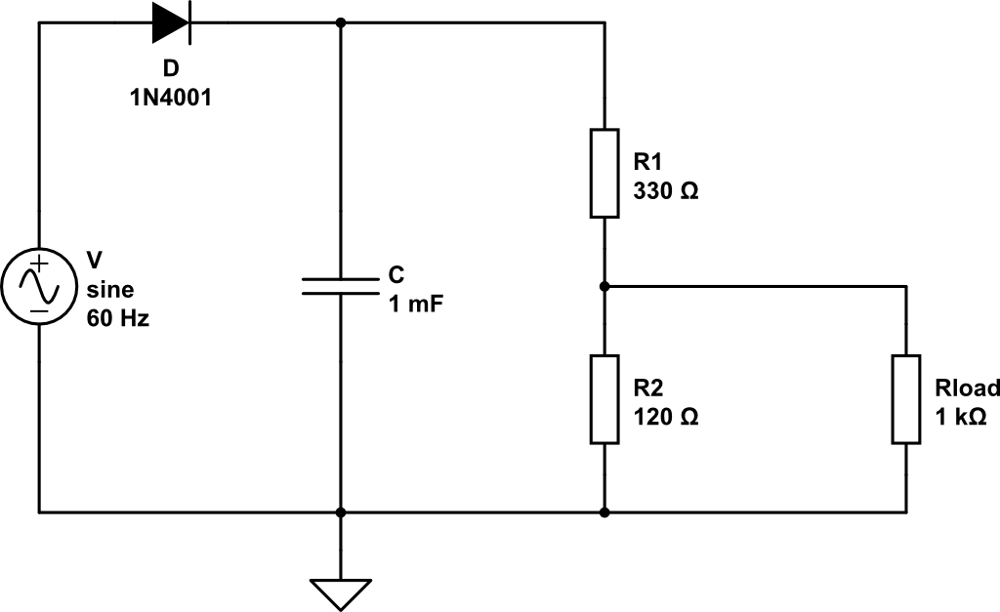
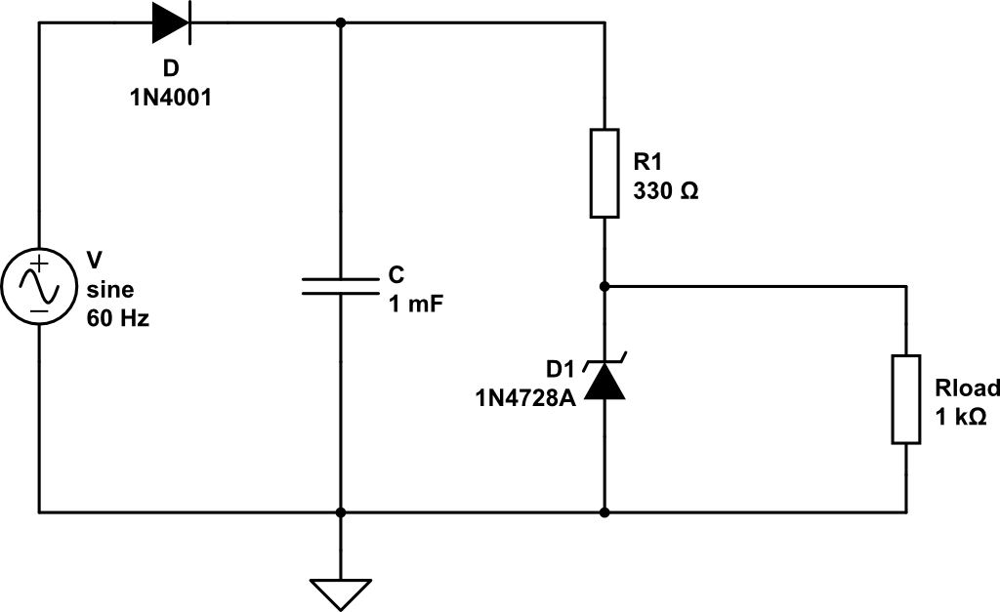

# Circuito

Encontre as correntes e tensões de todos os elementos do circuito a baixo :

{width=50%}

# Trabalhando com Zener

Considere o circuito a seguir 

{width=50%}

- https://www.circuitlab.com/circuit/5za92h/fonte-de-tensao-nao-estabilizada/

> Meça a tensão de saída (ou seja, no resistor de carga Rload)

> Calcule o ripple

## Usando um Zener

Modifique o circuito adicionando um diodo Zener 1N478A no lugar do R2, como a seguir :

{width=50%}

> Meça a tensão de saída (ou seja, no resistor de carga Rload)

> Calcule o ripple

> O que aconteceu ?

