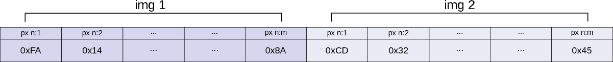
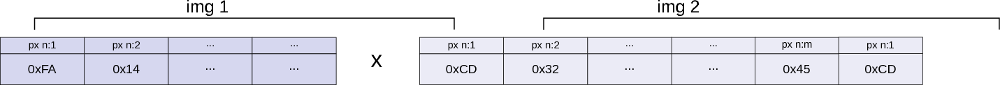
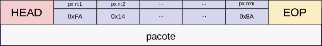
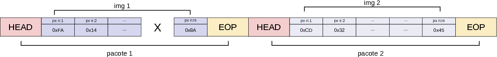
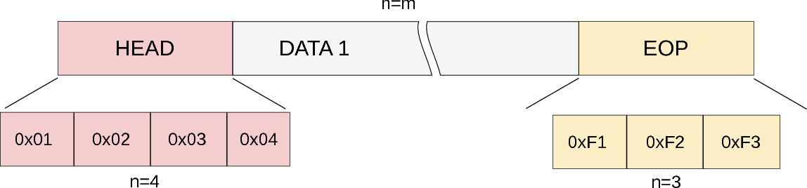
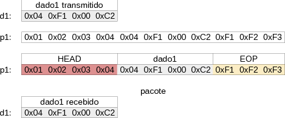
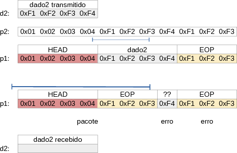

# Datagrama

O objetivo principal de uma rede de comunicações é o de estabelecer um canal de transferência de dados (seja ele analógico ou digital), uma comunicação pode operar como sendo um streaming de dados brutos, sem nenhuma manipulação. 

A Fig. a seguir ilustra a transmissão de uma imagem via streaming de dados sem nenhuma manipulação, os pixels da imagem 1 são enviados em sequência e logo após o final da transferência temos o início da transmissão da imagem 2. A imagem ou qualquer outro dado a ser transmitido é chamada de carga útil (cargo ou payload).

{ width=100% }

No diagrama anterior a imagem 1 transmitida contém *m* bytes de dados enquanto a imagem 2 transmitida também contém *m* bytes de dados.

Imagine a situação na qual um pixel é perdido na transmissão, como os dados não são encapsulados, a imagem 1 quando for construída terá como parte de seu conteúdo partes da imagem 2, a imagem 2 terá por sua vez conteúdos da imagem 3, como os dados são transmitidos sem nenhum controle não é possível identificar quando um começa e outro termina.

{ width=100% }

Esse formato de transferência de dados implica em dois problemas :

1. não é possível detectar a perda de dados na transmissão
2. os dados se misturam no caso de erros

```
Questão :
    - Dado que um canal de comunicação que opera com streaming de dados, 
    como fazer para transferir arquivos (no nosso caso imagens) de 
    tamanhos distintos ?
```

## Empacotamento

Uma solução para esse problema é o de inserir os dados a serem transmitidos em um "pacote", um pacote é constituído basicamente por um "cabeçalho" (*head*) e um fim de pacote (*end of packet*, **EOP**), definindo uma "linguagem" de comunicação entre dois pontos onde ambos os agentes da comunicação devem concordar com o formato de transmissão de dados. Com isso é fácil detectarmos o começo e o fim de um novo fluxo de dados.

{ width=100% }

Agora no caso de perda de dados durante a transmissão, fica fácil de detectar o começo e fim de um fluxo de dados, eles encapsulados entre duas palavras de controle.

{ width=100% }

```
Questão :
    - O que acontece se a perda de dados ocorrer no HEAD ou no EOP ? 
```

No caso do empacotamento, podemos definir uma quantidade qualquer de bytes para compor o HEAD e o EOP, eles podem variar de 1 byte até n v, dependendo somente da especificação do protocolo.

{ width=100% }

No pacote definido no exemplo anterior possuímos 4 bytes reservados para o HEAD, m bytes (sendo m um número qualquer) para a carga útil (cargo ou *pay load*) e 3 bytes para o fim de pacote. 

A escolha de como o HEAD e o EOP será composto varia entre diferentes protocolo. O HEAD pode carregar informações extras sobre o pacote, tal como: um contador incrementado a cada pacote;  o tipo de dado que o pacote carrega (payload ou comando); endereço de destino do pacote; ... . 

```
Questão :
    - Descreva o pacote que trafega na rede Ethernet, qual o
    significado de seus campos ? (ethernet frame)
```

### OverHead

Uma vez definido a quantidade de bytes reservados para a parte de controle do pacote (HEAD e EOP), podemos calcular o *protocol overhead*, que é a razão do tamanho total do pacote pelo tamanho de sua carga útil :

$$ OverHead = \frac{\text{Tamano Total}}{\text{Tamanho payload}}$$

Supondo para o exemplo anterior que o tamanho do dado fosse de 1024 bytes (m=1024), o overhead desse protocolo seria de  100.68%:

$$ OverHead =  1.006 = (4 + 3 + 1024)/1024 $$

O Overhead é um fator importante na análise de um protocolo, pois fornece indicações do quanto o protocolo em questão é eficiente, quanto maior o overhead menor será a quantidade de dados efetivos que uma rede está trafegando.

```
Questão  :
    - O que acontece com o overhead do exemplo anterior se o 
    payload for 32 bytes e 32000 ? (m=32 e m=32000)
```

```
Questão  :
    - Qual é o OverHead de uma comunicação TCP/IP, porque o mesmo varia ? 
```

### BaudRate 

A taxa em bits por segundo que uma rede consegue transmitir bits. A unidade bastante utilizada é bits por segundo (bits per second) : **bps**. Uma comunicação típica entre dois comutadores via conexão ethernet pode variar entre 10Mbps (10 milhões de bits por segundo) até 1Gbps (1 Giga bit por segundo).


### Troughput

Troughput é a definição de quão rápido um dado pode ser enviado em uma rede, o mesmo leva em consideração a taxa de envio (baudrate) o overhead de comunicação devido ao empacotamento e o overhead devido a serialização (iremos ver isso mais para frente).

```
    - Uma rede pode possuir taxas diferentes para download e upload,
    liste exemplos e explique o porque.
```

## Byte stuffing

Uma questão que aparece quando definimos as sequências de dados para o HEAD e o EOP (controle), é o se a mesma sequência aparecer como parte dos dados. Imagine a situação a seguir (com os mesmos HEAD e EOP definidos anteriormente).

{ width=100% }

Nesse caso não existe nenhum problema na detecção da sequência definida como sendo o HEAD e o EOP. 


Mas agora Veja a situação a seguir na qual o dado a ser transmitido possui como parte de sua sequência os mesmos valores definidos como sendo de controle (HEAD ou EOP), nesse caso o dado será confundido com os caracteres de controle, como no exemplo a seguir

Nesse caso, o payload a ser transmitido contém a mesma sequência de caracteres definido como sendo uma sequência de controle **EOP** (0xF1 0xF2 0xF3) , o que confundirá o receptor na hora da interpretação do pacote.

{ width=100% }

### Solução

A solução para essa questão é o chamado *Byte/bit stuffing*, onde o transmissor transforma os dados substituindo cada byte de controle por uma sequência e o receptor retornar essa sequência para o valor original. 

Para isso definimos um carácter especial chamado de ESC (escape), esse carácter será inserido sempre que uma sequência de controle for enviada a fim de alterar o seu conteúdo, como no exemplo a seguir :

```
ESC  : 0x00

Dado        : 0xF1 0xF2 0xF3 0xF4
(original)
 
Dado        : ESC  0xF1 ESC  0xF2 ESC  0xF3 ESC  0xF4
(stuffing)
 
Dado        : 0x00 0xF1 0x00 0xF2 0x00 0xF3 0x00 0xF4
(stuffing)

Pacote      : 0x01 0x02 0x03 0x04 0x00 0xF1 0x00 0xF2 
(enviado)     0x00 0xF3 0xF4 0xF1 0xF2 0xF3

Dado        : 0x00 0xF1 0x00 0xF2 0x00 0xF3 0x00 0xF4
(recebido)
Dado RX     : 0xF1 0xF2 0xF3 0xF4
(recuperado)

```

Mas e se o dado a ser enviado for o seguinte :

```
Dado        : 0x00 0xF1 0x00 0xF2 0x00 0xF3 0xF4
(original)
```

Como lidamos para ele não ser interpretado na hora da recuperação como :

```
Dado        : ESC 0xF1 ESC 0xF2 ESC 0xF3 0xF4
(recebido)

Dado        : 0xF1 0xF2 0xF3 0xF4 
(recuperado)
```

Devemos agora inserir um ESC sempre que aparecer um ESC no dado:

```
Dado        : 0x00 0xF1 0x00 0xF2 0x00 0xF3 0xF4
(original)

Dado
(stuffing)  : ESC  0x00 0xF1 ESC  0x00 0xF2 ESC 0x00 0xF3 0xF4

Dado
(stuffing)  : ESC  ESC  0xF1 ESC  ESC  0xF2 ESC  ESC  0xF3 0xF4

Dado
(stuffing)  : 0x00 0x00 0xF1 0x00 0x00 0xF2 0x00 0x00 0xF3 0xF4

Dado        : 0x00 0xF1 0x00 0xF2 0x00 0xF3 0xF4
(recuperado) 

```

# Referencias

[REF:1]: https://en.wikipedia.org/wiki/Client%E2%80%93server_model  "Wiki client server model"
[REF:2]: https://en.wikipedia.org/wiki/Overhead_(computing) "Wiki Overhead"

- [REF-1] : https://en.wikipedia.org/wiki/Client%E2%80%93server_model  "Wiki client server model"
- [REF-2] : https://en.wikipedia.org/wiki/Overhead_(computing) "Wiki Overhead"
- [REF-3] : http://packetpushers.net/tcp-over-ip-bandwidth-overhead/ (TCP/IP Overhead)
- [REF-4] : https://en.wikipedia.org/wiki/Ethernet_frame (Ethernet Frame)
- [REF-5] :        http://www.ques10.com/p/10736/what-is-bit-and-byte-stuffing-explain-with-examp-1/ (Byte stuffing)
