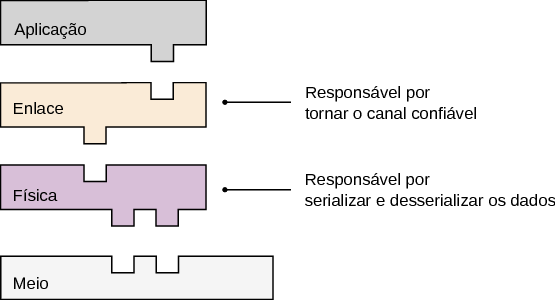
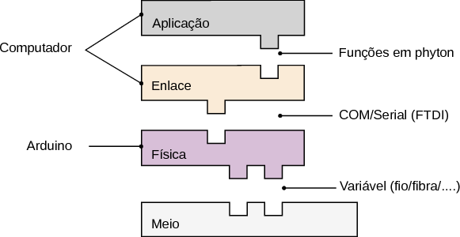
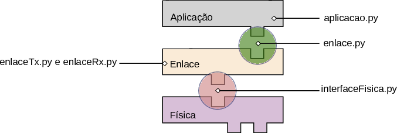
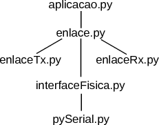
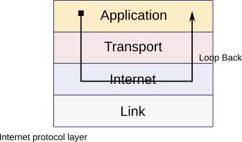
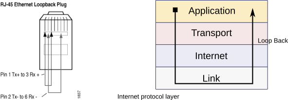
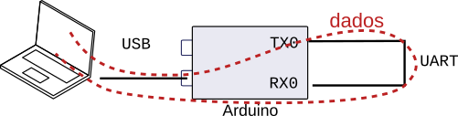
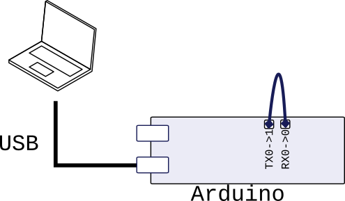
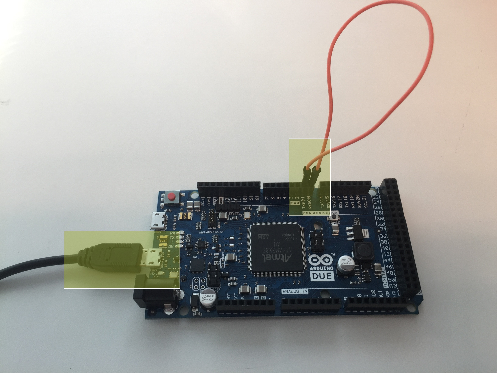

O exemplo localizado nessa pasta cria as seguintes camadas de abstração da comunicação :

{ width=50% }

Nesse protocolo, temos três camadas : Aplicação, enlace e física. As camadas são implementadas nos seguintes meios :

{ width=50% }

# Código base

O código possui os seguintes arquivos : aplicacao.py; enlace.py; enlaceTx.py; enlaceRx.py; interfaceFisica.py. Sendo cada um responsável por :

- aplicacao.py : Carrega uma imagem e a transmite via enlace. Após a transmissão recebe novamente a imagem e a salva em imgs/recebida.png

- enlace.py : Interface de comunicação entre a aplicação e o enlace.

- enlaceTx.py : parte do enlace responsável por transmitir n dados via a camada física (interfaceFisica.py)

- enlaceRx.py : parte do enlace responsável por receber n dados via a camada física (interfaceFisica.py)

- interfaceFisica.py : Código que lida com o envio dos dados para o Arduino e recebimento.

A figura a seguir faz uma relação dos códigos com cada etapa da comunicação a ser desenvolvida :



Com a seguinte árvore de dependência :

{ width=35% }

## Threads 

Para haver transmissão e recepção simultâneamente o código faz uso de threads, uma para enlaceTx e outra para o enlaceRX possibilitando que a interface enlace transmita e receba dados de forma contínua.

## Porta serial !

O endereço da porta serial vaira de sistema operacional para sistema operacional. Para listar as comunicações seriais presentes no seu computador basta executar o seguinte comando python:

```
# python3 -m serial.tools.list_ports
# /dev/ttyACM0        
# 1 ports found
```

No exemplo anterior, detectou-se uma porta serial localiozado em /dev/ttyACM0

Com esse dado, altere a variável *serialName* no arquivo aplicacao.py para o nome de sua porta. Por exemplo, se estiver executando no windows deverá alterar de :

```python
serialName = "/dev/ttyACM0"           # Ubuntu (variacao de)
```

para

```python
serialName = "COM2"                   # Windows
```

## Rodando o exemplo

1. Para executar o código exemplo é necessário configurar o ambiente de desenvolvimento :
    - [Configurando o ambiente](https://github.com/Insper/Camada-Fisica-Computacao/wiki/Configurando-ambiente---Projeto-Enlace)
    
1. Com o ambiente configurado verifique a porta serial e modifique o arquivo aplicacao.py 
1. execute com : python3 

```
python3 aplicacao.py
```

Esse exemplo lê uma imagem localizada na pasta **/imgs/imageX.png** e salva uma imagem recebida na mesma pasta porém com nome **recebida.png**

# Modo de comunicação - LoopBack


Conexões loopback são muito utilizadas para a validação e teste de comunicação, nessa topologia os dados de saída (TX) são conectados a sua própria entrada (RX) permitindo que os dados enviados possam ser lidos pelo memso nó. Existem [loopbacks](https://en.wikipedia.org/wiki/Localhost) em diversos níveis do protocolo, por exemplo: quando acessamos o endereço ttp://localhost (ou 172.0.0.1) no navegador estamos executando um loopback na camada IP, como ilustrado a baixo : 



Loobacks também podem ser executados na camada mais baixa da comunicação, para isso, deve-se conectar fisicamente a saída da placa de rede a sua entrada. No caso de um loopback físico de uma conexão Ethernet (via cabo de rede), deve-se modificar um cabo para que a saída (TX) seja ligado a sua entrada (RX), como ilustrado no diagrama a seguir : 



## Loopback serial

No nosso projeto, utilizamos o Arduino como placa de rede, e o protocolo UART como forma de comunicação entre dois nós. O loopback nesse caso se da conectando a saída da porta UART (TX0) a entrada da porta UART (RX0), assim todo dado que for transmitido pelo computador, será encaminhado para a porta TX0 e recebida pela porta RX0 e então devolvido ao computador pelo USB.




## Conexão :

- Conectar o TX0 (pino 1) no RX0 (pino 0)
- USB perto da fonte



### No mundo real ... 



