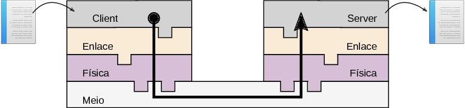

*Entrega : Próxima aula 17/8*

{ width=30% }

# Projeto 1 : Client-Server

Essa etapa do projeto consiste na modificação da comunicação em modo loopback
para uma comunicação ponto a ponto entre dois computadores via a interface UART.
Como ilustrado no diagrama a seguir :

{ width=100% }

Para tanto será necessário modificar o exemplo original (localizado no repositório em : /1-Materiais/0-COM-LoopBack/) para passar a funcionar de uma comunicação em modo loopback para uma comunicação ponto a ponto entre dois computadores.

Ler a respeito do modo loopback em :

- [Modo LoopBack](https://github.com/Insper/Camada-Fisica-Computacao/wiki/Hardware---Comunica%C3%A7%C3%A3o-modo-LoopBack)

## Papeis

- Client : O papel do client nesse caso será o do envio de uma imagem para o server.
- Server : O papel do server será o da recepção de uma imagem enviada pelo
  client.
  
## Requisitos

1. Criar os papeis de Client e Servidor
1. Comunicar dois computadores distintos enviando um arquivo entre eles
1. Documentar o protocolo.

## Validação

- Conectar dois computadores via arduino e transmitir um arquivo de tamanho definido entre os dois nós.

## Código base
 
- Um código base que faz a comunicação em modo loopback é fornecido em :
    - [3-Projetos/0-COM-LoopBack/](https://github.com/Insper/Camada-Fisica-Computacao/tree/master/3-Projetos/0-COM-LoopBack)

# Avaliação :

## Itens necessários para o aceite
- Aplicação
    - Possui Client e Server como aplicações distintas
    - Client
        - Lê um arquivo do computador e o transmite via enlace.
        - Cálculo do tempo de transmissão
    - Server 
        - Lê um arquivo via enlace e salva no computador.
        - Cálculo do tempo de recepção 
- Documentação
    - Diagrama de funcionamento
    - Diagrama de camadas

## Itens extras

- Aplicação
    - Interface gráfica para seleção de imagem a ser lida e salva

## Rubricas

| Nota máxima | Descritivo                                           |
|-------------|------------------------------------------------------|
| A           | - Entregue no prazo                                  |
|             | - Implementado extras                                |
| B           | - Entregue no prazo                                  |
|             | - Implementado itens necessários                     |
| C           | - Entregue fora do prazo                             |
|             | - Implementando itens ncessários                     |
| D           | - Nem todos os itens necessários foram implementados |
| I           | - Não entregue                                       |

