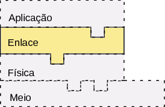

*Entrega : Até o começo da aula do dia 31/8*

{ width=30% }

- [1- COM - Client Server](https://github.com/Insper/Camada-Fisica-Computacao/tree/master/3-Projetos/1-COM-Client%20Server)
- [2- COM - Datagrama](https://github.com/Insper/Camada-Fisica-Computacao/tree/master/3-Projetos/2-COM-Datagrama)
- [3- COM - HandShake Ack e NACk](https://github.com/Insper/Camada-Fisica-Computacao/tree/master/3-Projetos/3-COM-HandShake-ACK-nACK)
    - **README**
    - Dicas
- [4- COM - Fragmentação e Deteçao de erros](https://github.com/Insper/Camada-Fisica-Computacao/tree/master/3-Projetos/4-COM-Fragmentacao-CheckSum)

# Projeto 3 : HandShake/ Ack e nACL

Implementar de forma incremental um protocolo de handshake entre na camada de enlace que garante ao *client* que dados só serão trafegados na rede quando o *server* estiver habilitado para receber. Além disso, um protocolo de reconhecimento (ACK e NACK) deve ser implementado para que o *client* tenha conhecimento do status da recepção do pacote pelo *server*, caso uma falha for detectada, reenviar o pacote.

- [Lista aula 5](https://github.com/Insper/Camada-Fisica-Computacao/blob/master/2-Aulas/5-HandShake-ACK-NACK/5-Lista-Handshake-Ack-Nack.pdf)

## Dicas

Algumas dicas de implementação podem ser lidas em : 
 
- [Dicas](https://github.com/Insper/Camada-Fisica-Computacao/blob/master/3-Projetos/3-COM-HandShake-ACK-nACK/3-COM-Dicas-HandShake-Ack-Nack.md)
  
# Requisitos

Requisitos de projeto :

1. Handshake (3Way)
    - *client* envia **SYN**, *server* responde com **ACK** + **SYN**, *client* responde com **ACK**.
    - Deve implementar ao menos os seguintes pacotes de comando (na interface enlace):
        - **SYN**  : Pacote de sincronismo 
        - **ACK**  : Pacote de reconhecimento positivo
        - **NACK** : Pacote de reconhecimento negativo
    1. Client :
        - Só pode enviar pacotes após handshake com Server
        - Deve possuir timeout para o handshake 
            - por exemplo, se o server não responder ao primeiro SYN deve enviar outro depois de *n* segundos.
    1. Server :
        - Deve aguardar pela inicialização 
        - Deve responder ao *Client* pelo pedido de inicialização.
1. Reconhecimento do pacote :
    - Após handshake o *Server* deve enviar um pacote de **ACK** ou **nACK** ao *Client* indicado o status da recepção do pacote.
    1. Client :
        - Deve enviar o pacote e aguardar pelo **ACK** ou **NACK**.
            - Caso receba um **NACK** deve reenviar o pacote.
            - Caso receba um **ACK** deve considerar o envio como positivo.
    1. Server :
        - Seve receber um pacote e verificar sua integridade.
            - Caso detecte uma anomalia, enviar um **NACK** e aguardar por novo pacote.
            - Caso receba o pacote de forma integra, enviar um **ACK** e salvar os dados.
1. Software
    - Logs em toda a etapa de Handshake (exibir no terminal o que está acontecendo).
    - Logs com relação ao ACK e nACK do pacote.

1. Documentação
    - Descrever o handshake implementado.
    - Descrever os pacotes (SYN,ACK,NACK).
        - diagrama dos pacotes.
    - Diagrame o envio de pacotes em como uma máquina de estados.
    - Diagrame a recepção de pacotes como uma máquina de estados.
    - Descrever o tempo de timeout utilizado (e o porque desse valor).
    - Como diferencia pacotes de comando (SYN,ACK,NACK) de pacote de dados ?
    
## Itens extras

1. Implementar o FIN (final de comunicação)
1. Inserir CheckSum no HEAD e Payload para detecção de anomalias nos pacotes

## Validação

- Inicializar o Client e não conectar o Server. Nenhuma imagem deve ser enviada.
- Após algum tempo inicializar o Server, deve acontecer o handshake e a transferência deve ser executada.
- Durante a transmissão, desconectar o fio que transmite dados entre Client e Server
    - Server deve responder com nACK
    - Client deve retransmitir o pacote.

## Rubricas

| Nota máxima | Descritivo                                                |
|-------------|-----------------------------------------------------------|
| A           | - Entregue no prazo                                       |
|             | - Implementado extras                                     |
| B           | - Entregue no prazo                                       |
|             | - Implementado requisitos necessários                     |
| C           | - Entregue fora do prazo                                  |
|             | - Implementando requisitos necessários                    |
| D           | - Nem todos os requisitos necessários foram implementados |
| I           | - Não entregue                                            |

