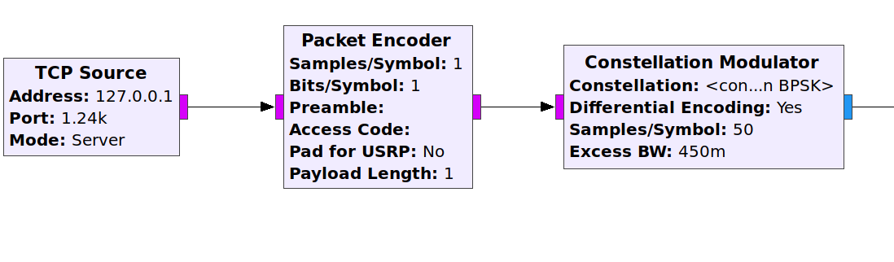

# Dicas de implementação :

1. LoopBack Mode
    - Trabalhar com o exemplo fornecido para ler via python a mensagem decodificada via GNURadio.
        - Ajuste de frequência:
             - Encontre uma frequência de transmissão para o seu sistema (microfone + falante) que funcione bem, com o GNURadio em execução, ajuste a barra de frequência até o mapa de constelação ficar em praticamente dois pontos, isso indica uma boa recepção dos dados.
    
        - **Recepção (recepcao.py)**
            - você deverá inicializar um socket server no python na porta especificada no gnuradio. Utilize o exemplo :
                 - exemplo-socket-server.py
            - para validar sem o GNURADIO você deve :
                 - executar o exemplo-socket-server.py
                 - em um terminal :
                      - nc localhost PORTA
                      - onde PORTA é a porta definida no socket (tem que ser a mesma no GNURadio)
                 - escreva um texto no terminal o mesmo deve aparecer no bash do python.
        - Criar uma interface estilo "chat" que recebe os dados enviados via socket e exiba para o usuário.
        
        - **Transmissão** 
            - Agora devemos modificar o exemplo do GNURadio fornecido para que o dado a ser enviado seja recebido via socket, altere o projeto para :
    
                - Nesse caso o GNURadio inicializa um socket Server e aguarda uma conexão, podemos testar com o comando nc :
                    - inicialize a recepcao.py
                    - inicialize o GNURadio
                    - conecte-se no GNURadio, abra um terminal e :
                        - nc localhost PORTA
                        - no exemplo : nc localhost 1240
                    - Envie uma string longa pelo terminal (socket recém conectado).
                    - O dado enviado via socket será : modulado, transmitido via áudio, recebido via microfone, demodulado e enviado via socket para o software python em execução (recepcao.py).
            - Crie um software transmissao.py
                 - esse software deverá agora conectar-se no socket criado pelo GNURADIO, para isso utilize o exemplo (Client) do link :
                 - (echo Client) https://pymotw.com/2/socket/tcp.html
                 - Crie uma interface que receba string (texto) e transmita esse texto para o socket recém criado.
                 
2. Dois PCs
     - O próximo passo será o de separar o que é transmissão e recepção em dois arquivos .grc diferentes :
          - qpsk-audio-transmissao.grc
               - possui somente a parte referente a transmissão
          - qpsk-audio-recepcao.grc
               - possui somente a parte referente a recepção
     - Rodar a transmissão (qpsk-audio-transmissao, transmissao.py) em um PC
     - Rodar a recepção (qpsk-audio-recepcao, recepcao.py) em outro PC
     - Transmitir dados entre eles.

