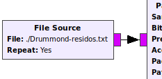
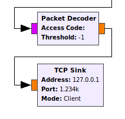
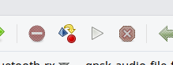
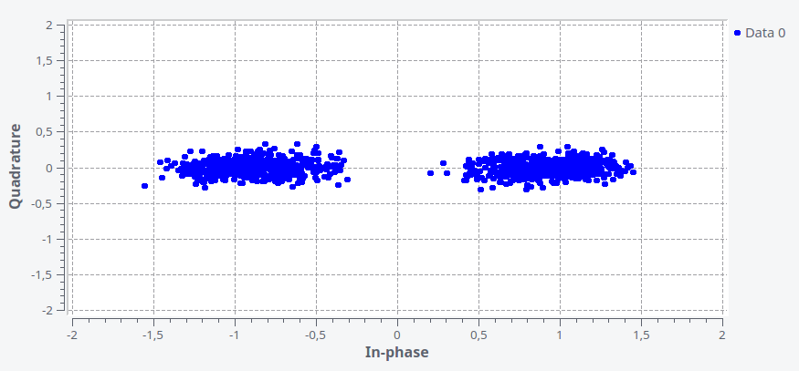

O exemplo fornecido na pasta : *[./materiais/bpsk-audio.grc]()* fornece um exemplo de como configurar o **GNURadio** para acessar um arquivo texto [Drummond-residos.txt](), modular e demodular os dados do arquivo texto em Binary Phase Shift Keying (BPSK).

O exemplo é baseado nos exemplos fornecidos pelo Dr. Aaron Scher em :

- http://aaronscher.com/GNU_Radio_Companion_Collection/GNU_Radio_Companion.html


### Configurando o arquivo de transmissão 

Para o exemplo funcionar corretamente é necessário configurar o arquivo de texto que será enviado pelo nosso modem. Abra o exemplo no GNURadio e modifique (clicando duas vezes no módulo) o *File Source* para ler o arquivo : **/materiais/Drummond-residos.txt**. Essa etapa é necessária pois O GNURadio não suporta caminhos relativos (vamos fazer um patch no GNURadio ?).

{width=40%}

### Inicializando uma comunicação socket

O mecanismo utilizado nesse exemplo de comunicação do GNURadio com o mundo externo é realizado via [SOCKET](https://en.wikipedia.org/wiki/Network_socket), como ilustrado a seguir (parte do diagrama completo de blocos) :



O bloco **TCP Sink** tenta conectar em um socket, o exemplo está configurado para operar no localHost na porta **1234**. Para o exemplo funcionar deveremos abrir uma conexão socket, para isso, abra o bash e digite :

```bash
  nc -l 1234
```

### Executando o GNURadio

Para executar o GNURadio basta clicar em : Run -> Execute ou :

{width=30%}

### Ajustando a frequência de transmissão

Quando em execução deveremos ajustar a frequência de transmissão (portadora) para um valor adequado ao falante/microfone em uso, para verificar a recepção deve-se analisar o diagrama de constelação em conjunto com o dado recebido, resultado deve ficar similar a :

{width=100%}


