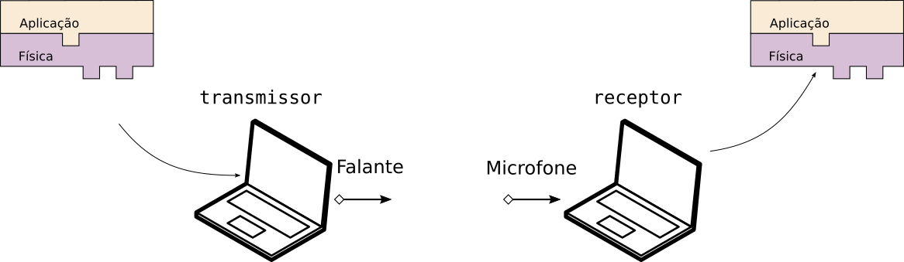
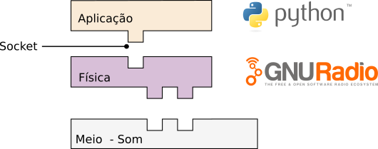

{width=80%}

# APS 8 : Modulação/DeModulação BPSK

Esse projeto tem como objetivo o envio de mensagens de texto entre dois computadores via modulação digital em :

# Requisitos

A modulação/demodulação deve ser implementada no GNU Radio, um software em python deve emular um "chat" de uma única via, onde em um computador a mensagem é enviado e em outro a mensagem é recebida e exibida na tela. 

## Software

O software a ser disponível deverá utilizar como interface física um rádio criado a partir do GNURadio, a interface da aplicação com o GNURadio será via socket TCP/IP (tanto para transmissão dos dados quanto para recepção) conforme diagrama a seguir :

### Pré requisitos: 

- Linux como sistema operacional, o GNURadio não opera corretamente no MAC e Windows.

- Instalar o GNURadio :
    - apt-get install gnuradio

- Instalar o netcat
    - apt-get install netcat
    
### [Exemplo](https://github.com/Insper/Camada-Fisica-Computacao/blob/master/3-Projetos/8-Modulacao-Digital/Exemplo/README.md)

-https://github.com/Insper/Camada-Fisica-Computacao/blob/master/3-Projetos/8-Modulacao-Digital/Exemplo/README.md

O exemplo fornecido na pasta : *[./materiais/bpsk-audio.grc](https://github.com/Insper/Camada-Fisica-Computacao/blob/master/3-Projetos/8-Modulacao-Digital/Exemplo/bpsk-audio.grc)* fornece um exemplo de como configurar o **GNURadio** para acessar um arquivo texto [Drummond-residos.txt](https://github.com/Insper/Camada-Fisica-Computacao/blob/master/3-Projetos/8-Modulacao-Digital/Exemplo/Drummond-residos.txt), modular e demodular os dados do arquivo texto em Binary Phase Shift Keying (BPSK).

## Descrição 

1. Transmissor.

     - Camada Física (.gnr)
         - Deve modular o sinal de áudio em BPSK
         - Deve abrir um "socket" e modular as mensagens digitais recebidas em BPSK via GNURadio
         - O sinal deve ser enviado via áudio
         - Deve possuir ajustes gráfico via GNURadio :
              - Símbolo por Sample (sps)
              - Frequência de transmissão
              - Volume
     - Camada Aplicação (.py)
         - Interface gráfica para envio de strings ao gnuradio via socket.
         
2. Receptor
    - Camada Física (.gnr)
        - Deve demodular o sinal de áudio recebido em BPSK
        - Deve-se conectar a um socket e transmitir as mensagens digitais 
    - Aplicação
        - Interface gráfica para recepção de dados do gnuradio via socket.
        
3. Documentação

    - Explicar a frequência de transmissão utilizada e a banda que o sinal ocupa.
    - Explicar o funcionamento geral do projeto.
    - Explicar a modulação BPSK
     - GNURadio
         - TX (todos os gráficos devem vir acompanhados de uma explicação)
             - Exibir o gráfico no tempo e em frequência do sinal não codificado
             - Exibir o gráfico no tempo e em frequência do sinal codificado (após o *constellation modulator*)
             - Exibir o gráfico no tempo e em frequência do sinal modulado
                 - explicar o gráfico resultante
             - Exibir o diagrama de constelação.
         - RX (todos os gráficos devem vir acompanhados de uma explicação)
             - Exibir o sinal de áudio recebido no tempo e em frequência
             - Exibir o sinal de áudio demodulado no tempo e em frequência
             - Exibir o diagrama de constelação.
## Itens extras

O desenvolvimento de somente um dos itens extras será considerado como A.

- Fazer uma transmissão fullduplex (permitir os dois computadores enviar mensagens simultaneamente)
 
Ou 

- Implementar uma transmissão com mais de um símbolo (QPSK)

Ou

- Implementar algum tipo de correção de erro na mensagem enviada (CRC, ACK/NACK/ Paridade...)

## Validação

- Em sala de aula, abrir as duas aplicações em computadores distintos e transmitir uma frase entre eles via o pipeline desenvolvido anteriormente.

## Rubricas

| Nota | Descritivo                                                |
|------|-----------------------------------------------------------|
| A    | - Entregue no prazo                                       |
|      | - Implementado um item do extras                          |
| B    | - Entregue no prazo                                       |
|      | - Implementado requisitos necessários                     |
| C    | - Entregue fora do prazo                                  |
|      | - Implementando requisitos necessários                    |
| D    | - Nem todos os requisitos necessários foram implementados |
| I    | - Não entregue                                            |

