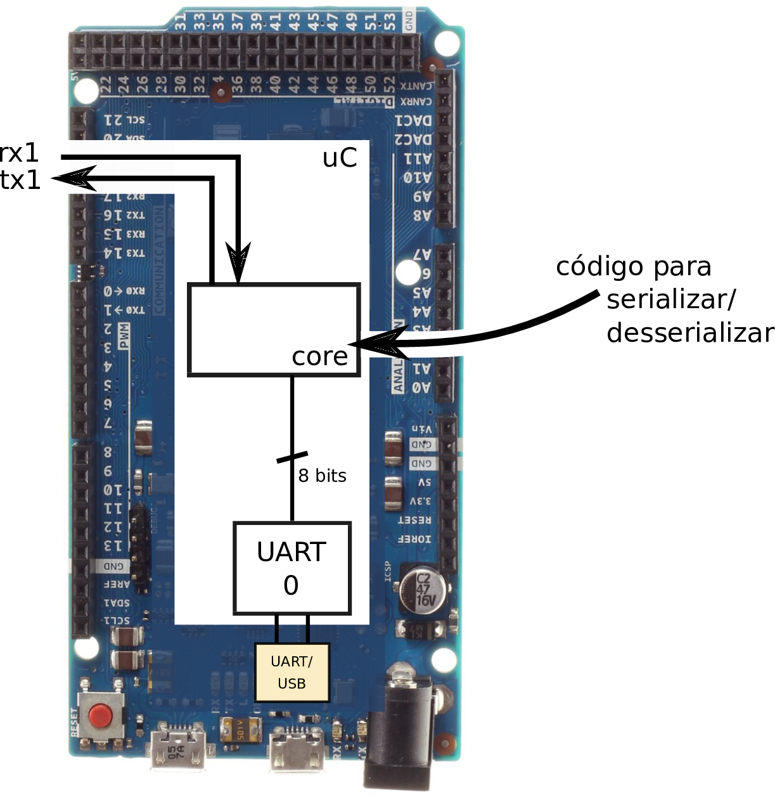

{width=50%}

# APS 9 : Serialização/Desserialização 

O objetivo principal desse projeto é o do entendimento de como uma mensagem é serializada e desserializada nos níveis mais baixos de uma comunicação.

# Projeto

Implementar a serialização/desserialização de um protocolo de comunicação (sugerimos o UART) em um arduino Due via software. 

## Pré requisitos: 

- Arduino Due
- Arduino IDE (> 1.8)
     - https://www.arduino.cc/en/Main/Software
- Digilent WaveForms 2015 (> 3.6.8)
     - http://store.digilentinc.com/waveforms-2015-download-only/
 
## Entendendo o protocolo 

O roteiro a seguir pretende guiar para o uso do analog discovery para análise de protocolos e também para o entendimento do protocolo UART. 

- [Roteiro 1 : Analisando o protocolo UART](https://github.com/Insper/Camada-Fisica-Computacao/tree/master/3-Projetos/9-COM-Serializacao/Roteiros/1-Analise-Protocolo)
- [Roteiro 2 : Recebendo dados via uart](https://github.com/Insper/Camada-Fisica-Computacao/tree/master/3-Projetos/9-COM-Serializacao/Roteiros/2-Recebendo-Dados)
- [Roteiro 3 : Implementando o TX](https://github.com/Insper/Camada-Fisica-Computacao/tree/master/3-Projetos/9-COM-Serializacao/Roteiros/3-Implementando-TX)
- [Roteiro 4 : Implementando o RX](https://github.com/Insper/Camada-Fisica-Computacao/tree/master/3-Projetos/9-COM-Serializacao/Roteiros/4-Implementando-RX)

## Requisitos 
1. Transmissor
     - serializar dados via uart embarcado no arduino
     
2. Receptor
     - desserializar dados via uart embarcado no arduino
          
3. Documentação
     - Explicar a comunicação UART
     - Exibir a forma de onda gerada pela implementação (usando o analog discovery)
     - Explicar o código

## Itens extras

- Implementar um protocolo próprio de transmissão e recepção de dados.

## Validação

- Em sala de aula, abrir as duas aplicações em computadores distintos e transmitir uma frase entre eles via o pipeline desenvolvido anteriormente.

## Rubricas

| Nota | Descritivo                                                |
|------|-----------------------------------------------------------|
| A    | - Entregue no prazo                                       |
|      | - Implementado um item do extras                          |
| B    | - Entregue no prazo                                       |
|      | - Implementado requisitos necessários                     |
| C    | - Entregue fora do prazo                                  |
|      | - Implementando requisitos necessários                    |
| D    | - Nem todos os requisitos necessários foram implementados |
| I    | - Não entregue                                            |

