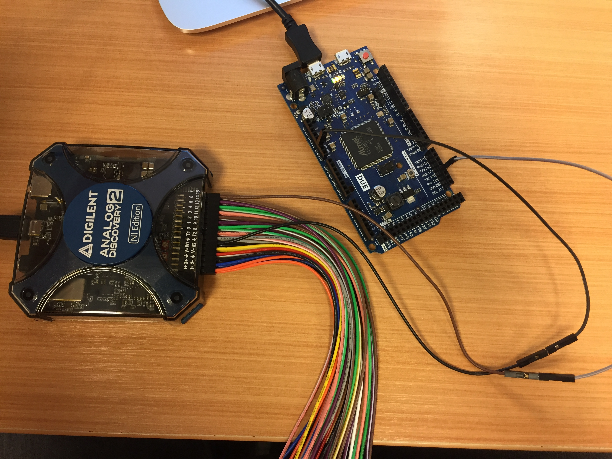
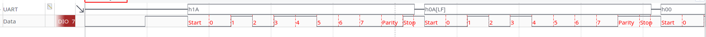

# Configurando o ambiente

- Material :
    - 1x Arduino Due
    - 1x Analog Discovery 
    - 2x Jumpers macho macho

## Arduino

Grave no arduino Due o código disponível : **UART1-TX:**. Esse exemplo configura a porta serial UART1 do arduino pinos TX **18** e RX **19** para operaram no modo UART 8 bits de payload, paridade par (odd) e dois bits de stop bit.

```C
 void setup() {
   Serial1.begin(9600,SERIAL_8O2);
 }
 
 void loop() {
  test_write();
 }
 
 void test_write() {
     Serial1.write("Cam Fisica");
     delay(1);
 }
 
 void test_receive() {
 
 }
```

O código fica enviando a uma taxa de 9600 bits por segundo a frase : **Cam Fisica** pela porta serial. A UART suporta (diversos modos de operação)[https://www.arduino.cc/en/Serial/Begin], sendo os mais utilizados :

```
  SERIAL_8N1 : 8bits - NONE parity - 1 stop bit
  SERIAL_8N2 : 8bits - NONE parity - 2 stop bit
  SERIAL_8O1 : 8bits - odd parity  - 1 stop bit
  SERIAL_8E1 : 8bits - even parity - 1 stop bit
```

Para ativar-los, basta alterar a segunda linha do código, por exemplo, para ativarmos a transmissão sem paridade :

```C
   Serial1.begin(9600,SERIAL_8N1);
```

## Analog discovery 

Conecte o **pino 7*** do analog discovery no **pino TX1** do arduino (***pino 18**) e também algum dos pinos de terra do analog no terra do arduino (**gnd**), conforme imagem a seguir :

{width=60%}

## Wave Forms

Inicialize o WaveForms e importe o workspace fornecido (uart1.dwf3work)

 workspace -> open -> uart1.dwf3work
 
Agora você será capaz de analisar o dados que estão sendo enviados pelo Arduino via serial. Analise os bits e tente entender o que é Start bit, payload, paridade e stop bit.

Execute a captura (RUN) e pause para analisar os dados, você deverá obter algo como :

{width=100%}


