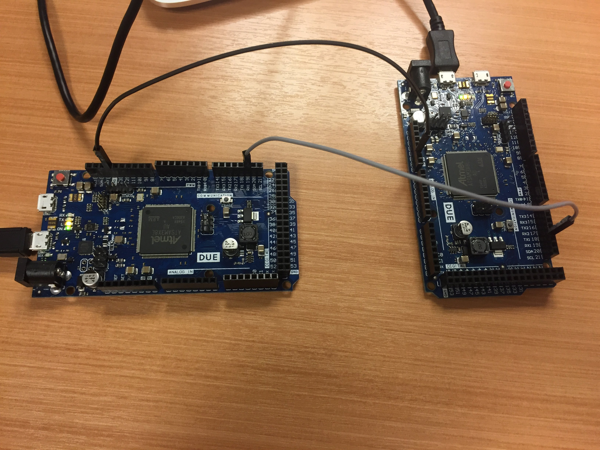

# Configurando o ambiente

- Material :
    - 2x Arduino Due
    - 2x Jumpers macho macho

Esse roteiro demonstra a comunicação de dois arduinos via UART, algo similar a isso era utilizado nos primeiros projetos da disciplina porém sem o entendimento do que estava acontecendo.

Dois arduinos (arduino-1 e arduino-2) serão conectados via comunicação UART, os dados enviados de um será lido pelo outro e exibido no terminal do computador.

## Conexão

{width=60%}

- arduino-1 : será o Transmissor (TX)
- arduino-2 : será o receptor (RX)

Conecte os terras dos arduinos (gnd) e o pino TX1 (pino 19) do arduino-1 ao pino RX1 (pino 19) do arduino-2. Em cada um dos arduinos grave o seguinte software:

- arduino-1 : /UART1-TX
- arduino-2 : /UART1-RX

O código do UART1-TX é exatamente igual ao roteiro 1, já o do arduino 2 é diferente :

```C
/**
 * Arduino-2 : Recepção RX
 */
 // stores received byte

void setup() {
  Serial.begin(115200);   
  Serial1.begin(9600,SERIAL_8O2);   
}

void loop() {
 test_receive();
}

void test_write() {
}

void test_receive() {
  byte rx_byte = 0;        
  if (Serial1.available()){
    rx_byte = Serial1.read();
    Serial.write(rx_byte);
  }           
}

```

Esse código é feito para receber o dado da UART1 e encaminhar o dado para a UART0 (onde o PC está ligado via USB**.

## Terminal

No computador que gravou o arduino-2, abra o terminal no arduino IDE:

**tools -> Serial Monitor***

Configure a porta para operar em 115200, você deve começar a receber a mensagem enviada pelo arduino-1, como na figura a seguir :


