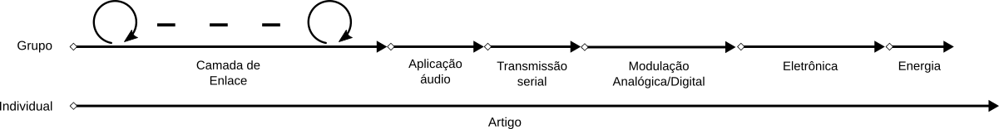

# Indice 

## Projetos
- [1- COM - Client Server](https://github.com/Insper/Camada-Fisica-Computacao/tree/master/3-Projetos/1-COM-Client%20Server)
- [2- COM - Datagrama](https://github.com/Insper/Camada-Fisica-Computacao/tree/master/3-Projetos/2-COM-Datagrama)
- [3- COM - HandShake Ack e NACk](https://github.com/Insper/Camada-Fisica-Computacao/tree/master/3-Projetos/3-COM-HandShake-ACK-nACK)
- [4- COM - Fragmentação e Deteçao de erros](https://github.com/Insper/Camada-Fisica-Computacao/tree/master/3-Projetos/4-COM-Fragmentacao-CheckSum)
- [5- DTMF - Encoder DTMF](https://github.com/Insper/Camada-Fisica-Computacao/tree/master/3-Projetos/5-DTMF-Encode)
- [6- DTMF - Decoder DTMF](https://github.com/Insper/Camada-Fisica-Computacao/tree/master/3-Projetos/6-DTMF-Decoder)

## Artigos

- [A - Idealização](https://github.com/Insper/Camada-Fisica-Computacao/tree/master/3-Projetos/A-ARTIGO-Ideia)
- [B - Resumo e Pesquisa bibliográfica](https://github.com/Insper/Camada-Fisica-Computacao/tree/master/3-Projetos/B-Resumo-Bibliografia)

# Projetos 

Os projetos a serem desenvolvidos na disciplina de Camada Física da Computação
irão englobar as três grandes áreas da disciplina: Comunicação, eletrônica e
energia. Duas linhas serão levadas simultâneamente: a dos projetos em grupo e a
da escrita de artigo individual.

{ width=100% }

## Projeto individual : Artigo científico 

A fim de introduzir a metodologia cintífica, os alunos deverão de forma
individual trabalhar em um artigo científico de um tema de sua escolha, essa
atividade durará o semestre inteiro com uma apresentação de fechamento. Entregas
parciais serão exigidas a fim de mantermos uma organizamção do tempo e lógica.

## Projetos em grupo 

Os projetos são propostos com o intuíto de introduzir de forma sequência
conceitos técnicos envolvidos nos tópicos da disciplina.

### Grupos

Os grupos devem ser formados idealmente por 4 alunos, se não for possível dado a
quantidade de aluno na sala, um grupo com menor quantidade dever ser formado.

O grupo será avaliado coletivamente e individualmente, via o acompanhamento da
evolução do projeto no github, trello e demais plataformas. O comrpimento da
meta pelo grupo não automatiza a distribuição uniforme da nota entre os integrantes.

### Camada de enlace : Desenvolvendo um protocolo

O objetivo desse projeto é o do entendimento da camada de enlace (link layer) de
uma comunicação genérica, os alunos em seus grupos irão desenvolver um protocolo
capaz de estabelecer um link virtual seguro entre dois computadores. O projeto é
fragmentado em 5 entregáveis :

1. Comunicação Client - Server
1. Empacotamento dos dados
1. Handshake e reconhecimento (Ack/nAck)
1. Fragmentação e checksum

### Camada de aplicação : Envio de áudio

O próximo projeto é o da utilização do protocolo desenvolvido anteriormente para
o envio de um áudio coletado pelo microfone de um computador para o outro. Esse
projeto visa trabalhar com a alteração da aplicação mantendo todo o pipline de
comunicação, e servirá também de introdução a transformada de Fourier e análise
de sinais em frequência.

### Camada física : Transmissão serial

Após termos trabalhados com as camadas mais superiores de um protocolo, iremos
agora trabalhar na serialização dos dados, papel responsável pela camada mais
baixa do modelo OSI (camada física), para isso os grupos deverão implementar o
protocol UART em software para o Arduino, substitutindo então o periférico UART
que estava sendo utilizado até o momento.

### Camada Física : Transmissão sem fio

Nesse projeto iremos trabalhar com transmissão sem fio, estudando as diferentes
formas de modulação e demodulação de dados. Os grupos deveram implementar via
gnuradio o pipline de demodulação de um sinal analógico, utilizando um SDR para
a leitura dos sinais.

### Camada Física : Eletônica

Toda a computação moderna é baseada em circuitos eletrônicos (digitais e
analógicos). Esse projeto visa aboradar os conceitos e teorias mais importantes
para o engenheiro da computação. Os alunos deverão projetar um amplificador
utilizando AMP-OP para amplificar algum tipo de sinal.

### Energia

Um estudo sobre o consumo de energia de um datacenter deverá ser feito pelos
grupos a fim de estudar os impactos pela escolha de uma tecnologia específica .
